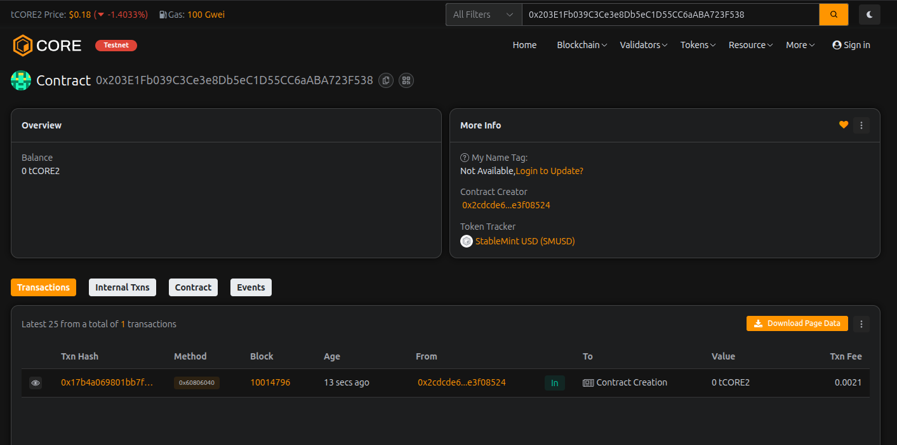

# StableMint Reserve

## Project Description

StableMint Reserve is a decentralized stablecoin protocol that enables users to mint USD-pegged stablecoins (SMUSD) by depositing ETH as collateral. The system maintains stability through over-collateralization, requiring users to deposit more value in ETH than the stablecoins they mint. This creates a secure, transparent, and decentralized alternative to traditional stablecoins.

The protocol operates on a simple principle: users deposit ETH into the reserve, which serves as collateral backing for the stablecoins they mint. The system enforces a minimum collateralization ratio (default 150%) to ensure the stablecoins remain fully backed even during market volatility. Users can burn their stablecoins at any time to unlock their collateral and withdraw their ETH.

## Project Vision

Our vision is to create a trustless, transparent, and decentralized stablecoin ecosystem that empowers users with:

- **Financial Sovereignty**: Users maintain full control over their collateral and can mint/burn stablecoins permissionlessly
- **Transparency**: All collateral ratios, minting, and burning operations are visible on-chain
- **Stability**: Over-collateralization ensures the stablecoin maintains its peg even during market downturns
- **Accessibility**: Anyone with ETH can participate without intermediaries or centralized control

We envision StableMint Reserve becoming a cornerstone of DeFi infrastructure, providing a reliable and decentralized stable asset for trading, lending, and everyday transactions.

## Key Features

### Core Functionality
- **Collateral Management**: Deposit and withdraw ETH collateral with complete transparency
- **Mint Stablecoins**: Generate SMUSD tokens based on your deposited collateral
- **Burn Mechanism**: Redeem stablecoins to unlock your collateral
- **Over-Collateralization**: Configurable collateral ratio (default 150%) ensures system stability

### Security Features
- **Health Monitoring**: Real-time collateralization ratio tracking for all users
- **Pausable Contract**: Emergency pause functionality for security incidents
- **Owner Controls**: Adjustable parameters to respond to market conditions
- **Locked Collateral Protection**: Cannot withdraw collateral that backs minted stablecoins

### Token Features
- **ERC-20 Compatible**: Standard transfer, approve, and transferFrom functions
- **Full Transparency**: All balances and collateral deposits are publicly viewable
- **Event Logging**: Comprehensive event emission for tracking all operations

### User Benefits
- **No Liquidation Risk**: Users control when to burn and withdraw
- **Flexible Collateral**: Add more collateral anytime to improve health ratio
- **Permissionless**: No KYC or registration required
- **Self-Custody**: Users always maintain control of their assets

## Future Scope

### Phase 1: Multi-Collateral Support
- Support for additional collateral types (WBTC, stETH, USDC)
- Dynamic collateral ratios based on asset volatility
- Weighted collateral portfolios for diversified backing

### Phase 2: Advanced Risk Management
- Automated liquidation system for under-collateralized positions
- Oracle integration for real-time price feeds
- Stability fees and interest mechanisms
- Emergency shutdown procedures

### Phase 3: Governance & Decentralization
- DAO governance token for protocol parameters
- Community-driven collateral ratio adjustments
- Decentralized oracle network
- Protocol revenue distribution to token holders

### Phase 4: DeFi Integration
- Integration with major DEXs for liquidity pools
- Lending/borrowing protocol partnerships
- Cross-chain bridges for multi-chain deployment
- Yield farming opportunities for SMUSD holders

### Phase 5: Enhanced Features
- Stability pool for liquidation buffer
- Flash mint capabilities for arbitrage
- Synthetic asset creation beyond stablecoins
- Insurance fund for black swan events
- Mobile app for easier user access

### Long-term Vision
- Become a leading decentralized stablecoin protocol
- Establish SMUSD as a widely accepted stable asset in DeFi
- Build a comprehensive ecosystem of financial products
- Achieve full decentralization with no single point of control

---

## Technical Details

**Solidity Version**: ^0.8.0  
**License**: MIT  
**Token Standard**: ERC-20 Compatible

## Getting Started

1. Deploy the StableMintReserve.sol contract to your preferred network
2. Deposit ETH collateral using `depositCollateral()`
3. Mint stablecoins with `mintStablecoin(amount)`
4. Use your SMUSD for DeFi activities
5. Burn stablecoins with `burnStablecoin(amount)` when ready
6. Withdraw collateral using `withdrawCollateral(amount)`

## Security Considerations

- Always maintain adequate collateralization ratio
- Monitor your position health regularly
- Be aware of ETH price volatility impacts
- This is experimental software - use at your own risk
- Consider getting a professional audit before mainnet deployment

---

## Contract Details: 

Transaction id: 0x203E1Fb039C3Ce3e8Db5eC1D55CC6aABA723F538
